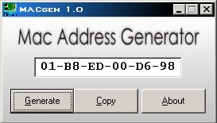



## MAC address generator

### Description

This simple app generates a MAC address for Ethernet cards. Maybe it can be useful for you.
 
### More Info
 

             |
---                |---
**Submitted On**   |2005-08-11 19:30:04
**By**             |[Henry\_Mendes](https://github.com/Planet-Source-Code/PSCIndex/blob/master/ByAuthor/henry-mendes.md)
**Level**          |Intermediate
**User Rating**    |3.0 (6 globes from 2 users)
**Compatibility**  |VB 3\.0, VB 4\.0 \(16\-bit\), VB 4\.0 \(32\-bit\), VB 5\.0, VB 6\.0
**Category**       |[Internet/ HTML](https://github.com/Planet-Source-Code/PSCIndex/blob/master/ByCategory/internet-html__1-34.md)
**World**          |[Visual Basic](https://github.com/Planet-Source-Code/PSCIndex/blob/master/ByWorld/visual-basic.md)
**Archive File**   |[MAC\_addres1923158112005\.zip](https://github.com/Planet-Source-Code/henry-mendes-mac-address-generator__1-62156/archive/master.zip)

